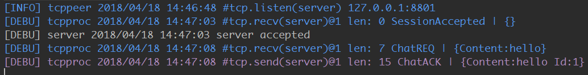
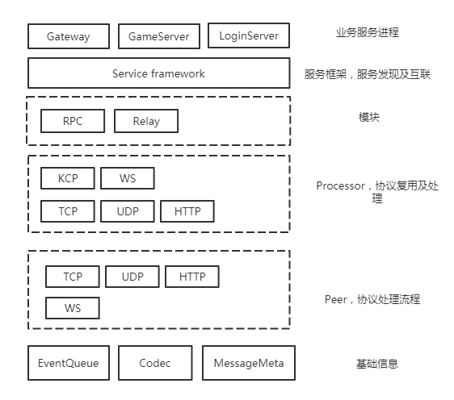
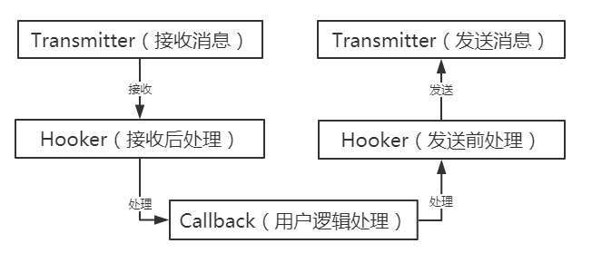

 [![Build Status][3]][4] [![Go Report Card][5]][6] [![MIT licensed][11]][12] [![GoDoc][1]][2]

[1]: https://godoc.org/github.com/davyxu/cellnet?status.svg
[2]: https://godoc.org/github.com/davyxu/cellnet
[3]: https://travis-ci.org/davyxu/cellnet.svg?branch=master
[4]: https://travis-ci.org/davyxu/cellnet
[5]: https://goreportcard.com/badge/github.com/davyxu/cellnet
[6]: https://goreportcard.com/report/github.com/davyxu/cellnet
[11]: https://img.shields.io/badge/license-MIT-blue.svg
[12]: LICENSE

cellnet是一个组件化、高扩展性、高性能的开源服务器网络库

# 使用领域

cellnet经过多个版本的迭代，无论是作为初学者学习的范例，还是作为私用、商用项目的基础构建乃至核心技术层已经在业内广受了解及使用。

主要使用领域：

- 游戏服务器

  方便定制私有协议，快速构建逻辑服务器、网关服务器、服务器间互联互通、对接第三方SDK、转换编码协议等

- ARM设备

  设备间网络通讯

- 证券软件

  内部RPC

# 特性 (Features)

## 传输协议支持
- TCP

    TCP连接器的重连，侦听器的优雅重启。

- UDP

    纯UDP裸包收发

- HTTP(测试中)

    侦听器的优雅重启, 支持json及form的收发及封装。编写游戏服务器时，不再需要使用第三方HTTP服务器对接SDK。

    注: 如需要对接大规模网页, 请使用第三方专业网络库,如(https://github.com/gin-gonic/gin), cellnet的http支持主要目的在用统一的地址及peer管理

- WebSocket

    采用(github.com/gorilla/websocket)实现

## 编码(Codec)

* cellnet内建支持以下数据编码:
    - Google Protobuf (https://github.com/google/protobuf)

    - json
        适合与第三方服务器通信

    - 二进制协议(https://github.com/davyxu/goobjfmt)

       内存流直接序列化, 适用于服务器内网传输

    - ProtoPlus(https://github.com/davyxu/protoplus)

       增加并优化过的Protobuf的编码格式

    可以通过codec包自行添加新的编码格式

* 支持混合编码收发

    无需改动代码，只需调整消息注册方式，即可达成运行期同时收发不同编码的封包

    - 与其他语言编写的服务器使用protobuf

    - 与web服务器使用json通信
    
    - 与Unity3D(C#)使用ProtoPlus(github.com/davyxu/protoplus)协议通信

    优点：

    - 享受不同通信协议格式的优点，避免缺点。如Protobuf适合服务器间的传输，封包小，适应面广。

    - 私有的二进制协议方便加密和客户端处理，低GC和实现复杂度。

## 队列实现各种单线程/多线程，异步/同步业务处理模型

  使用队列消息处理结构，方便实现以下效果：

* 单线程异步逻辑，适用于MMORPG复杂交互，免加锁处理共享数据。

* 多线程同步逻辑，适用于机器人逻辑，每个机器人使用独立的goroutine收发处理，机器人间互不干扰。

* 多线程并发逻辑，适用于网关，消息转发，HTTP服务器，每条消息处理都会在完全并发下。

## 远程过程调用（RPC）

* 支持同步RPC，适用于后台服务器向其他服务器请求数据后再顺处理事务。

* 支持异步RPC，适用于单线程服务器逻辑。

## 消息日志
* 可以方便的通过日志查看收发消息的每一个字段消息



# 获取+编译

编译和使用cellnet，请下载Go1.10以上版本

```
  go get -u -v github.com/davyxu/cellnet

  go get -u -v github.com/davyxu/golog

  go get -u -v github.com/davyxu/goobjfmt

  go get -u -v github.com/davyxu/protoplus
```

# 第三方库

cellnet 使用Protobuf时，需要使用附带的pb插件生成一个绑定代码，下面的链接可以处理这个问题
[Google Protobuf 编码安装](https://github.com/davyxu/cellnet/blob/master/doc/pbcodec.md)

[WebSocket实现](https://github.com/gorilla/websocket)

# 架构

cellnet架构层次由如下图所示：



cellnet对Processor和Peer进行高度抽象，用户可以从这两个层面横向扩展以满足不同的网络封装需求

红色框内的部分为cellnet实现部分

# 消息处理流程

cellnet的消息收发处理流程如下图所示：



本图对应的接口为cellnet/processor.go


# 样例
```golang

const peerAddress = "127.0.0.1:17701"

// 服务器逻辑
func server() {

    // 创建服务器的事件队列，所有的消息，事件都会被投入这个队列处理
	queue := cellnet.NewEventQueue()

    // 创建一个服务器的接受器(Acceptor)，接受客户端的连接
	peerIns := peer.NewGenericPeer("tcp.Acceptor", "server", peerAddress, queue)

    // 将接受器Peer与tcp.ltv的处理器绑定，并设置事件处理回调
    // tcp.ltv处理器负责处理消息收发，使用私有的封包格式以及日志，RPC等处理
	proc.BindProcessorHandler(peerIns, "tcp.ltv", func(ev cellnet.Event) {

        // 处理Peer收到的各种事件
		switch msg := ev.Message().(type) {
		case *cellnet.SessionAccepted: // 接受一个连接
			fmt.Println("server accepted")
		case *TestEchoACK: // 收到连接发送的消息

			fmt.Printf("server recv %+v\n", msg)

            // 发送回应消息
			ev.Session().Send(&TestEchoACK{
				Msg:   msg.Msg,
				Value: msg.Value,
			})

		case *cellnet.SessionClosed: // 会话连接断开
			fmt.Println("session closed: ", ev.Session().ID())
		}

	})

    // 启动Peer，服务器开始侦听
	peerIns.Start()

    // 开启事件队列，开始处理事件，此函数不阻塞
	queue.StartLoop()
}

// 模拟客户端逻辑
func client() {

    // 例子专用的完成标记
	done := make(chan struct{})

    // 创建客户端的事件处理队列
	queue := cellnet.NewEventQueue()

    // 创建客户端的连接器
	peerIns := peer.NewGenericPeer("tcp.Connector", "client", peerAddress, queue)

    // 将客户端连接器Peer与tcp.ltv处理器绑定，并设置接收事件回调
	proc.BindProcessorHandler(peerIns, "tcp.ltv", func(ev cellnet.Event) {

		switch msg := ev.Message().(type) {
		case *cellnet.SessionConnected: // 已经连接上
			fmt.Println("client connected")
			ev.Session().Send(&TestEchoACK{
				Msg:   "hello",
				Value: 1234,
			})
		case *TestEchoACK: //收到服务器发送的消息

			fmt.Printf("client recv %+v\n", msg)

			// 完成操作
			done <- struct{}{}

		case *cellnet.SessionClosed:
			fmt.Println("client closed")
		}
	})

    // 开启客户端Peer
	peerIns.Start()

    // 开启客户端队列处理
	queue.StartLoop()

	// 等待客户端收到消息
	<-done
}

```

# 目录功能

[目录及功能一览](https://github.com/davyxu/cellnet/blob/master/doc/dirstruct.md)

# 运行聊天例子

**确认GOPATH设置正确！！**

假设 GOPATH设置为/home/you/go

那么 cellnet结构位于 /home/you/go/src/github.com/davyxu/cellnet


## 运行 服务器

```bash
cd examples/chat/server

go run main.go
```

## 运行 客户端

```bash
cd examples/chat/client

go run main.go
```

随后, 在命令行中输入hello后打回车, 就可以看到服务器返回

```

sid1 say: hello

```

# 基本概念及使用说明

理解下面链接中的概念，可以迅速使用cellnet做基本的网络通讯及消息处理

* [队列](https://github.com/davyxu/cellnet/blob/master/doc/queue.md)

* [端(Peer)](https://github.com/davyxu/cellnet/blob/master/doc/peer.md)

* [收发处理消息](https://github.com/davyxu/cellnet/blob/master/doc/procmsg.md)


# 扩展及定制

若cellnet内建的Peer, Codec及Processor流程不能满足你的需求，可以阅读下面链接内容，添加并扩展cellnet功能

* [定制封包编码(Codec)](https://github.com/davyxu/cellnet/blob/master/doc/customcodec.md)

    封包编码可以是JSON，Protobuf等

* [定制端(Peer)](https://github.com/davyxu/cellnet/blob/master/doc/custompeer.md)

    新增Redis连接器，与cellnet自带的TCP/UDP的Peer都不同。

* [定制处理器(Processor)](https://github.com/davyxu/cellnet/blob/master/doc/customproc.md)

    需要在收发包时有统一的处理行为

# FAQ

[常见问题及回答](https://github.com/davyxu/cellnet/blob/master/doc/faq.md)

这里应该有你想知道的答案

# 基于cellnet的游戏服务器框架

cellmesh
https://github.com/davyxu/cellmesh


# 贡献者

按贡献时间排序，越靠前表示越新的贡献

superikw(https://github.com/superikw), 在v3中测试出一个websocket接口并发发送问题，wss支持，修复会话管理。

bruce.hu(https://github.com/hxdhero), 在v3中测试出一个竞态冲突的bug

M4tou(https://github.com/mutousay), 在v3中协助解决RPC异步超时回调处理

chuan.li(https://github.com/blade-226), 在v3中提供一个没有在io线程编码的bug

Chris Lonng(https://github.com/lonnng), 在v3中提供一个最大封包约束造成服务器间连接断开的bug

IronsDu(https://github.com/IronsDu), 在v2中大幅度性能优化

viwii(viwii@sina.cn), 在v2中，提供一个可能造成死锁的bug

# 版本历史
2018.5  v4版本 [详细请查看](https://github.com/davyxu/cellnet/blob/v4/CHANGES.md)

2017.8  v3版本 [详细请查看](https://github.com/davyxu/cellnet/blob/v3/CHANGES.md)

2017.1  v2版本 [详细请查看](https://github.com/davyxu/cellnet/blob/v2/CHANGES.md)

2015.8	v1版本


# 备注

感觉不错请star, 谢谢!

知乎: http://www.zhihu.com/people/sunicdavy

提交bug及特性: https://github.com/davyxu/cellnet/issues
