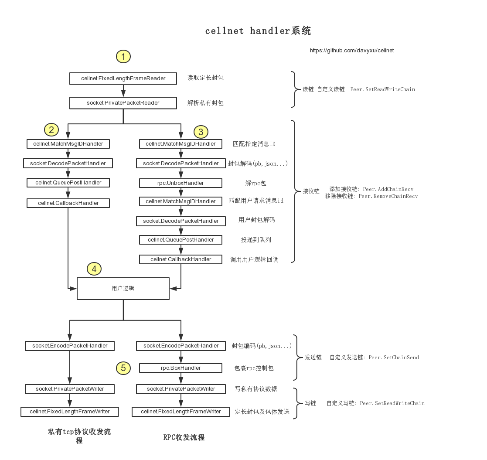

# cellnet
 [![Build Status][3]][4] [![Go Report Card][5]][6] [![MIT licensed][11]][12] [![GoDoc][1]][2]

[1]: https://godoc.org/github.com/davyxu/cellnet?status.svg
[2]: https://godoc.org/github.com/davyxu/cellnet
[3]: https://travis-ci.org/davyxu/cellnet.svg?branch=v3
[4]: https://travis-ci.org/davyxu/cellnet
[5]: https://goreportcard.com/badge/github.com/davyxu/cellnet
[6]: https://goreportcard.com/report/github.com/davyxu/cellnet
[11]: https://img.shields.io/badge/license-MIT-blue.svg
[12]: LICENSE

cellnet是一个高性能，简单，方便的开源服务器网络库

自由混合编码，业务代码无需调整。

TCP和html5的应用都可以直接使用cellnet迅速搭建服务器框架。

与Java的Netty或Mina网络库类似的Handler机制将给予强大定制功能。


# 特性

## 数据协议

* 编码支持:
    - Google Protobuf (https://github.com/google/protobuf)

    - 云风的sproto (https://github.com/cloudwu/sproto)

        能方便lua的处理, 本身结构比protobuf解析更简单
    - json

    - 二进制协议(https://github.com/davyxu/goobjfmt)

       内存流直接序列化, 服务器间传输效率更高

* 支持混合编码收发
    - 与Unity3D+Lua使用sproto通信

    - 与其他语言编写的服务器使用protobuf

    - 与web服务器使用json通信

    无论使用何种协议, 使用cellnet响应/收发消息的写法都保持一致

* 传输协议支持:

   - TCP(基于Type-Length-Value私有协议)

   - WebSocket


## 基于handler处理链

* 自定义, 组装收发流程, 包头等

* 支持专有日志调试, 方便查看处理流程

## 队列及IO
  
* 支持多个队列, 实现单线程/多线程收发处理消息

* 发送时自动合并封包(性能效果决定于实际请求和发送比例)


## RPC

* 异步/同步远程过程调用

## 消息日志
* 可以方便的通过日志查看收发消息的每一个字段消息

# 第三方库依赖

* github.com/davyxu/golog

* github.com/davyxu/goobjfmt

# 编码包可选支持

* github.com/golang/protobuf

* github.com/davyxu/gosproto

# websocket可选支持

* github.com/gorilla/websocket

# 获取+编译

```
	go get -u -v github.com/davyxu/cellnet

```

例子主要采用了protobuf做编码，因此需要安装protobuf支持

```
	go get -v github.com/golang/protobuf

```


# 性能测试

命令行: go test -v github.com/davyxu/cellnet/benchmark/io

平台: Windows 7 x64/CentOS 6.5 x64

测试用例: localhost 1000连接 同时对服务器进行实时PingPong测试

配置1: i7 6700 3.4GHz 8核

IOPS: 12.5w

配置2: i5 4590 3.3GHz 4核

IOPS: 10.1w

# 样例
```golang


func server() {

	queue := cellnet.NewEventQueue()

	p := socket.NewAcceptor(queue).Start("127.0.0.1:7201")

	cellnet.RegisterMessage(p, "gamedef.TestEchoACK", func(ev *cellnet.Event) {
		msg := ev.Msg.(*gamedef.TestEchoACK)

		log.Debugln("server recv:", msg.Content)

		ev.Send(&gamedef.TestEchoACK{
			Content: msg.String(),
		})

	})

	queue.StartLoop()

}

func client() {

	queue := cellnet.NewEventQueue()

	p := socket.NewConnector(queue).Start("127.0.0.1:7301")

	cellnet.RegisterMessage(p, "gamedef.TestEchoACK", func(ev *cellnet.Event) {
		msg := ev.Msg.(*gamedef.TestEchoACK)

		log.Debugln("client recv:", msg.Content)
	})

	cellnet.RegisterMessage(p, "coredef.SessionConnected", func(ev *cellnet.Event) {

		log.Debugln("client connected")

		ev.Send(&gamedef.TestEchoACK{
			Content: "hello",
		})

	})

	cellnet.RegisterMessage(p, "coredef.SessionConnectFailed", func(ev *cellnet.Event) {

		msg := ev.Msg.(*coredef.SessionConnectFailed)

		log.Debugln(msg.Reason)

	})

	queue.StartLoop()
}

```

# 目录功能

```
benchmark           性能测试用例

proto               cellnet内部的proto

    binary          内部系统消息,rpc消息

    pb              protobuf消息(內部測試用)

    sproto          sproto的消息(內部測試用)

protoc-gen-msg      protobuf的protoc插件, 消息id生成, 使用pb编码时使用

objprotogen         binary格式的消息绑定工具, 使用binary编码时使用

rpc                 异步远程过程调用封装

socket              套接字,连接管理等封装

example             例子

    chat            聊天服务器例子

    echo_websocket  websocket服务器例子

tests               测试用例

timer               计时器接口

util                工具库

```


# 运行聊天例子

## 运行 服务器

```bash
cd examples/chat/server

go run main.go
```

## 运行 客户端

```bash
cd examples/chat/client

go run main.go
```

随后, 在命令行中输入hello后打回车, 就可以看到服务器返回

```

sid1 say: hello

```

## 协议生成

这个例子中实现了最简单的客户端与服务器通信

通信使用examples/chat/proto/chat.proto的protobuf协议定义

修改协议后, 可使用GenerateProto.bat进行协议生成

生成代码时, 会编译protoc-gen-go和protoc-gen-msg两个插件

配合protobuf的协议编译器protoc.exe, 分别生成chatproto目录下的chat.pb.go和msgid.go两个文件


# 术语及概念

## 队列

队列在cellnet中使用cellnet.Queue接口, 底层由带缓冲的channel实现

在cellnet中, 队列根据实际逻辑需要定制数量. 但一般情况下, 仅需要1个队列

使用下列代码使用队列

```golang
    queue := cellnet.NewEventQueue()

    // 启动队列
    queue.StartLoop()

    // 这里添加队列使用代码

    // 等待队列结束, 调用queue.StopLoop(0)将退出阻塞
    queue.Wait()
```


当在多线程环境中, 需要将逻辑排队执行时, 我们只需要这样写:

```golang
    queue.Post(func() {
		fmt.Println("hello")
	})

```

我们使用的消息, 在底层就是通过queue.Post() 传入我们给定的回调进行处理的

### 提示

队列对于使用cellnet的服务器程序不是必须的.不使用队列时, 所有消息的处理将是并发在多线程下


## 侦听和接受连接

使用如下代码创建一个接受器(Acceptor)

```golang
    queue := cellnet.NewEventQueue()

    peer := socket.NewAcceptor(queue)

    peer.Start("127.0.0.1:8801")
```

底层将自动完成侦听, 接受连接, 错误抛出, 断开处理等复杂操作

### 提示

- cellnet将系统事件, 错误和用户消息均视为消息, 并可以被注册回调后处理, 接口都是统一的


接受器可接收的系统消息可以用下面代码注册并响应:

```golang
cellnet.RegisterMessage(peer, "coredef.SessionAccepted", func(ev *cellnet.Event) {		
    // 其他会话连接时
})

cellnet.RegisterMessage(peer, "coredef.SessionAcceptFailed", func(ev *cellnet.Event) {		
    // 其他会话连接失败时
})
```

## 发起连接

使用如下代码创建一个连接器(Connector)

```golang
    queue := cellnet.NewEventQueue()

    peer := socket.NewConnector(queue)

    peer.Start("127.0.0.1:8801")
```

底层将自动完成连接; 如果发生断开, 可以通过如下代码设置自动重连

```golang
    // 设置连接超时2秒后自动重连
    peer.(socket.Connector).SetAutoReconnectSec(2)
```

连接器也可以接收系统事件, 如:
```golang
cellnet.RegisterMessage(peer, "coredef.SessionConnectFailed", func(ev *cellnet.Event) {		
    // 会话连接失败
})

```

### 提示:

- 端
    
    cellnet中, Connector和Acceptor被统称为Peer, 即"端", 当连接器和接受器建立连接后, 两个"端"的概念, 接口和使用均是相同的

# 会话连接(Session)

建立连接后, 这个连接在cellnet中称为Session

## Session ID
每个会话拥有一个64位ID, cellnet底层保证在一个Peer中不会重复

可以通过Session.ID() 获得ID

## 获得Session
Session可以通过以下途径获得:

- 通过cellnet.RegisterMessage注册回调后, 通过回调参数*cellnet.Event中的Ses获得

- 如果Peer是Connector, 可以通过如下代码获得连接器上默认连接

```golang
    ses := peer.(socket.Connector).DefaultSession()
```

- Peer可以通过SessionAccessor接口以多种方式获得Session, 如:
```golang

    // 通过Session.ID获得
    GetSession(int64) Session

    // 遍历这个Peer的所有Session
    VisitSession(func(Session) bool)

```

## 接收消息

消息通过cellnet.Event传递

如需获得消息, 我们使用如下代码获得消息
    
```golang
    msg := ev.Msg.(*MsgPackage.YourMsgType)
```

## 接收系统事件

如需接收Session连接断开事件, 使用如下代码
```golang
cellnet.RegisterMessage(peer, "coredef.SessionClosed", func(ev *cellnet.Event) {		
    // 会话断开时
})

```


## 会话发送消息

一般情况下, 我们的消息使用结构体实现. 使用protobuf工具链, sproto工具链可以直接生成这些结构体.

通过Session.Send()发送一个结构体指针, 如:
```golang
    ses.Send(&chatproto.ChatREQ{
			Content: str,
		})
```


### 提示

- 使用Event.Send方式回消息

```golang
    cellnet.RegisterMessage(peer, "chatproto.ChatACK", func(ev *cellnet.Event) {
		msg := ev.Msg.(*chatproto.ChatACK)

        // 使用这种方法回应消息与rpc系统统一, 便于底层优化
		ev.Send( msg )
	})

```

- 不要缓存Event

Event是消息处理的上下文, 不建议缓存Event


# FAQ

* 这个代码的入口在哪里? 怎么编译为exe?

    本代码是一个网络库, 需要根据需求, 整合逻辑

* 支持WebSocket么?

    支持!

    本网络库的Websocket基于第三方整合, 包格式基于文本: 包名\n+json内容

    参见examples/websocket

* 混合编码有何用途?

    在与多种语言写成的服务器进行通信时, 可以使用不同的编码,
    最终在逻辑层都是统一的结构能让逻辑编写更加方便, 无需关注底层处理细节

* 内建支持的二进制协议能与其他语言写成的网络库互通么?

    完全支持, 但内建二进制协议支持更适合网关与后台服务器.
    不建议与客户端通信中使用, 二进制协议不会忽略使用默认值的字段

* 我能通过Handler处理链进行怎样的扩展?

    封包需要加密, 统计, 预处理时, 可以使用Handler. 每个Handler建议无状态,
    需要存储的数据, 可以通过Event中的Tag进行扩展

* 如何查看Handler处理流程?
    在程序启动时, 调用如下代码
```golang
    cellnet.EnableHandlerLog = true
```

   可在日志中看到如下日志格式

```
    [DEBUG] cellnet 2000/00/00 01:02:03 9 Event_Connected [svc->agent] <DecodePacketHandler> SesID: 1 MsgID: 3551021301(coredef.SessionConnected) {} Tag: <nil> TransmitTag: <nil> Raw: (0)[]
```

    9 表示一个Event处理序号, 同一序号表示1个处理流程, 例如1个接收/发送流程

    Event_Connected 表示事件名

    [svc->agent] 表示peer的名称

    <DecodePacketHandler> 表示Handler的名称, 通过反射取得

    SesID 表示 会话ID, 由SessionManager分配

    MsgID 表示消息号, 后面括号中是对应的消息名, 如果未在系统中注册, 显示为空, 后续是消息内容

    TransmitTag, Tag 附属上下文内容

    Raw, 表示消息的原始二进制信息


* 所有的例子都是单线程的, 能编写多线程的逻辑么?

    完全可以, cellnet并没有全局的队列, 只需在Acceptor和Connector创建时,
    传入不同的队列, socket收到的消息就会被放到这个队列中
    传入空队列时, 使用并发方式(io线程)调用处理回调

* 消息日志为什么与处理函数日志顺序不统一?

    由于消息日志反应的是收到消息的日志, 因此必须放置在io线程中处理. 而单线程逻辑与io线程分别在不同的线程. 日志顺序错位是正常的
    如果需要顺序日志: 可以在进程启动时, 调用runtime.GOMAXPROCS(1), 将go的线程调度默认为1CPU

* cellnet有网关和db支持么?

    cellnet专注于服务器底层.你可以根据自己需要编写网关及db支持

* cellnet的私有tcp封包格式是怎样的?


    功能 | 类型 | 备注
    ---|---|---
    序号 | uint16 | 初始为1, 接收一次自增1
    消息ID | uint32 | 包.消息名 的hash值(util.StringHash)
    包体大小 | uint32 | 包体大小
    包体 | []byte | 包体内容, 长度为包体大小指定, 变长

    封包解析请参考:
    https://github.com/davyxu/cellnet/blob/master/socket/handler_privatepkt.go

* 怎样定制私有tcp封包?
    使用cellnet.Peer下组合接口的HandlerChainManager.SetReadWriteChain进行设置, 写法如
    ```golang
	self.SetReadWriteChain(func() *cellnet.HandlerChain {
		return cellnet.NewHandlerChain(
			cellnet.NewFixedLengthFrameReader(10),
			NewPrivatePacketReader(),
		)
	}, func() *cellnet.HandlerChain {
		return cellnet.NewHandlerChain(NewPrivatePacketWriter(),
			cellnet.NewFixedLengthFrameWriter(),
		)
	})

    ```

    HandlerChainManager拥有读写链和收发链, 处理流程如下:

    读链->接收链->逻辑处理->发送链->写链


* 哪里有cellnet的完整例子?

    CellOrigin是基于cellnet开发的一套Unity3D客户端服务器框架
    https://github.com/davyxu/cellorigin




# 版本历史
2017.8  v3版本 [详细请查看](https://github.com/davyxu/cellnet/blob/v3/CHANGES.md)

2017.1  v2版本 [详细请查看](https://github.com/davyxu/cellnet/blob/v2/CHANGES.md)

2015.8	v1版本


# 贡献者

按贡献时间排序，越靠前表示越新的贡献

superikw(https://github.com/superikw), 测试出一个websocket接口并发发送问题

bruce.hu(https://github.com/hxdhero), 测试出一个竞态冲突的bug

M4tou(https://github.com/mutousay), 协助解决RPC异步超时回调处理

chuan.li(https://github.com/blade-226), 提供一个没有在io线程编码的bug

Chris Lonng(https://github.com/lonnng), 提供一个最大封包约束造成服务器间连接断开的bug

IronsDu(https://github.com/IronsDu), 大幅度性能优化

viwii(viwii@sina.cn), 提供一个可能造成死锁的bug


# 备注

感觉不错请star, 谢谢!

博客: http://www.cppblog.com/sunicdavy

知乎: http://www.zhihu.com/people/sunicdavy

提交bug及特性: https://github.com/davyxu/cellnet/issues
